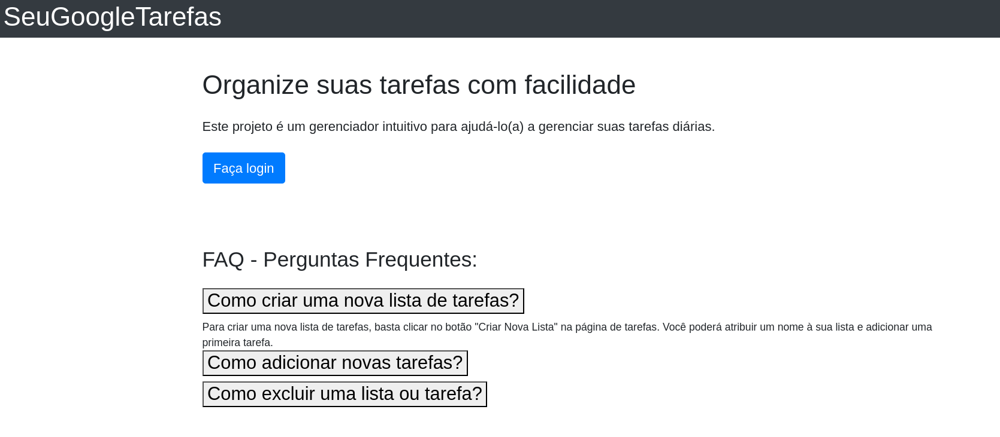
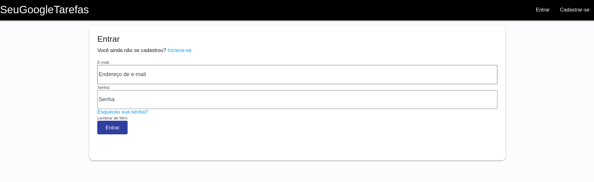
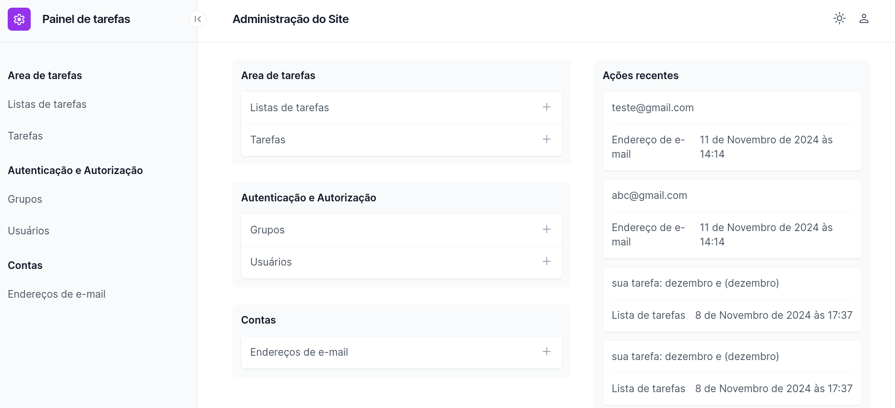

# SeuGoogleTarefas

É um projeto que visa de forma proposital usar excesso de engenharia (Overengineering) para ser
laboratório de testes de boas praticas e bibliotecas.
</b>

# Como Usar

Quando você acessar irá encontrar uma página inicial assim, construida com html e bootstrap, o foco não é uma interface visual complexa mas sim um o fluxo da aplicação e as ferramentas utlizadas:
 

  

 

# Página de Login

Todo o fluxo de autenticação foi desenvolvido utilizando a famosa biblioteca Django-allauth
 

  

 

# Painel de administração

O Painel administrativo default do django foi atualizado com o template do django-unfold e outras libs como django-filter e django-import-export.

  

 

# Como Contribuir
Estou aberto para contribuições! Se você deseja contribuir, siga os passos abaixo:

1. Faça um fork do projeto.
2. Crie uma branch para sua feature (git checkout -b feature/nova-feature).
3. Faça commit das suas alterações (git commit -m 'Adiciona nova feature').
4. Faça push para a branch (git push origin feature/nova-feature).
5. Abra um Pull Request.